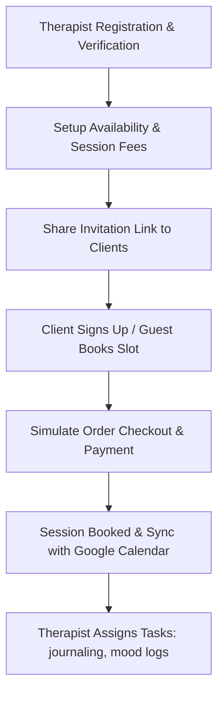

# Introduction to Emotist

Welcome to the **Emotist Project Documentation**! This guide outlines the system goals, workflows, and core architecture of the Emotist telehealth ecosystem.

---

## 🌟 Business Overview (Non-Technical Perspective)

Emotist is a next-generation teletherapy and mental health management platform. It bridges the gap between **therapists (mental health practitioners)** and **clients (patients)**, providing a secure, seamless digital workspace for clinical care.

### Core Value Proposition
- **Practitioner Empowerment**: Streamlines clinical workflows (scheduling, journaling, charting) so therapists can focus on therapy rather than administration.
- **Client Engagement**: Provides client-facing tools (mood tracking, assigning journaling tasks, easy bookings) to keep clients active and supported between sessions.
- **Seamless Financial Operations**: Automated invoicing, order creation, and payment collection via Razorpay integrations.
- **Security & Privacy First**: Fully encrypted communication channels adhering to clinical documentation standards.

### Core Workflows



1. **Onboarding & Verification**: Therapists undergo a 3-step verification wizard (Personal details, Professional qualifications, Document upload). Once verified by administrators, their profiles become active.
2. **Consultation Setup**: Verified therapists configure their practice hours, session durations (e.g. 50 minutes), consultation fees, and session options (individual vs group).
3. **Session Scheduling & Payments**: Clients browse therapist profiles, choose slot timings, pay securely through integrated payment gateways, and receive instant confirmations.
4. **Active Care & Tasks**: During therapy, practitioners assign tasks (such as mood tracking logs, reading list recommendations, or structured journaling) that clients can complete directly on their mobile application.

---

## ⚙️ Technology Stack (Technical Perspective)

Emotist is designed as a high-performance **monorepo** utilizing modern JavaScript frameworks, asynchronous queue pipelines, and distributed persistence.

### Key Technologies
- **Monorepo Manager**: [Lerna](https://lerna.js.org/) + [Nx](https://nx.dev/) (orchestrates packages, caches builds, and executes fast parallel pipelines).
- **Backend API**: [NestJS](https://nestjs.com/) (TypeScript framework following Domain-Driven Design and CQRS design patterns).
- **Frontend Portals**: [React](https://react.dev/) + [TypeScript](https://www.typescriptlang.org/) + [Vite](https://vite.dev/) (separate responsive dashboards for therapists and clients).
- **Mobile Application**: [Expo](https://expo.dev/) / React Native (cross-platform client mobile app).
- **Database & Auth**: [Supabase](https://supabase.com/) (PostgreSQL storage layer, local emulation auth hooks, and object storage buckets).
- **Asynchronous Task Queue**: [BullMQ](https://bullmq.io/) + [Redis](https://redis.io/) (used for background jobs like processing webhooks, calendar syncing, and sending notification emails).

---

## 🧭 Monorepo Project Layout

```
emotist-app/
├── apps/
│   ├── api/            # NestJS backend API service
│   ├── therapist/      # Therapist dashboard (React SPA)
│   ├── client/         # Client portal dashboard (React SPA)
│   └── client-app/     # Client mobile application (Expo)
├── packages/
│   ├── react-components/   # Shared UI components library
│   ├── utils/              # Shared TypeScript utilities
│   └── workspace/          # Centralized lint and build presets
└── scripts/            # Razorpay simulation checkout harness & Dagger CI configs
```

Next, read the [Installation Guide](installation) to boot the monorepo services locally on your machine.
